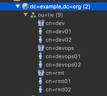

# Grafana auth with LDAP

An example setup of grafana authentication and authorization using LDAP.

[More Details on LDAP integration] (https://grafana.com/docs/grafana/latest/auth/ldap/)

#### Challenge
- For authorization at dashboards level - grafana suggests to use [Teams] (https://grafana.com/docs/grafana/latest/manage-users/manage-teams/). 
An user can be part of multiple teams and each team can be authorized to view/edit particular dashboards.
  
- Teams have to created manually -  syncing Teams with LDAP groups is an [enterprise feature] (https://grafana.com/docs/grafana/latest/enterprise/enhanced_ldap/).
  
#### Proposed Solution
- As a workaround, we can use orgs to group the dashboards and control the access to dashboards at org level.

#### Run it yourself

- Clone the repo.
- Install docker and docker-compose - if not present.

To start  -  `make start`

use any browser and access grafana at  (http://localhost:3000)

To stop   - `make stop`

To clean  - `make clean`

#### Configuration
- To provision dashboards during start up and have them tied a particular org - we would need the org to be created before hand.
- We use liquibase migrations to achieve it.
- To add another org - add the insert statement in another changeset in changelog.xml file.
- Provisioning of dashboards are done using dashboards.yaml
- Below org structure is pre-loaded in openLDAP service.
  
    
  

- LDAP group mappings are present in ldap.toml.

##### Brief explantion of ldap.toml

```
bind_dn = "cn=admin,dc=example,dc=org"
bind_password = 'adminpassword'
search_filter = "(|(cn=%s)(mail=%s))"
search_base_dns = ["dc=example,dc=org"]
```

* bind_dn and bind_password are used by grafana to authenticate with LDAP. Bind_dn used should have list and read privileges for the org in LDAP.
* search_base_dns is the base of org tree used for searching authenticating users. All users who want to authenticate to grafana must be part of this dc.
* search_filter used for filtering/finding the user. Generally mail or cn (commonName) fields are used to uniquely identify the user.

```text
    Note: %s in the filter is replaced by corresponding value entered in username field of grafana UI.
```

```text
    group_search_filter = "(&(objectClass=groupOfNames)(member=cn=%s,ou=tw,dc=example,dc=org))"
    group_search_filter_user_attribute = "cn"

```
* By default grafana uses memberOf attribute of the user to fetch groups of the user trying to authenticate.
* openLDAP schema doesnot have memberOf field. So we customize the query used for fetching Groups association using `group_search_filter`.
* For example above filter gets all the objects with `objectClass=groupOfNames` ( which are all the groups ) and filters them by member attribute.
* `group_search_filter_user_attribute` is used to replace %s in group_search_filter.

###### Current LDAP Configuration

- We have 3 orgs with org ids - 1, 2, 3
- And each dashboards is part of a single org.
- We have 3 LDAP groups - Devops, Dev, RMT
- A single user can be part of multiple LDAP groups.
- Access to the user is determined by UNION of access provided by all group_mappings - Hence there are no conflicts.

`Devops` - Any user part of this group is a grafana super admin, and admin for all orgs. Note that this has to be explicitly configured for all the orgs.
Being a super admin, doesn't  guarantee access to all orgs by default.
```text
    [[servers.group_mappings]]
    group_dn = "cn=devops,ou=tw,dc=example,dc=org"
    org_role = "Admin"
    grafana_admin = true
    org_id = 1
    
    [[servers.group_mappings]]
    group_dn = "cn=devops,ou=tw,dc=example,dc=org"
    org_role = "Admin"
    org_id = 2
    
    [[servers.group_mappings]]
    group_dn = "cn=devops,ou=tw,dc=example,dc=org"
    org_role = "Admin"
    org_id = 3
 ```

`RMT` - Any user part of rmt group has editor access to org 2. ( and all dashboards tied to org 2)
```text
    [[servers.group_mappings]]
    group_dn = "cn=rmt,ou=tw,dc=example,dc=org"
    org_role = "Editor"
    org_id = 2
```

`Dev` - Any user part of dev group has view only access to org 2. ( and all dashboards tied to org 2)

```text
    [[servers.group_mappings]]
    group_dn = "cn=rmt,ou=tw,dc=example,dc=org"
    org_role = "Editor"
    org_id = 2
```

All the users (irrespective of LDAP groups) have editor access to org 3.

```text
    [[servers.group_mappings]]
    group_dn = "*"
    org_role = "Editor"
    org_id = 3
```

Usernames:

Devops - devops01, devops02
Devs - dev01, dev02
RMT - rmt01, rmt02

Passwords - password1 (for all 1s), password2( for all 2s)


